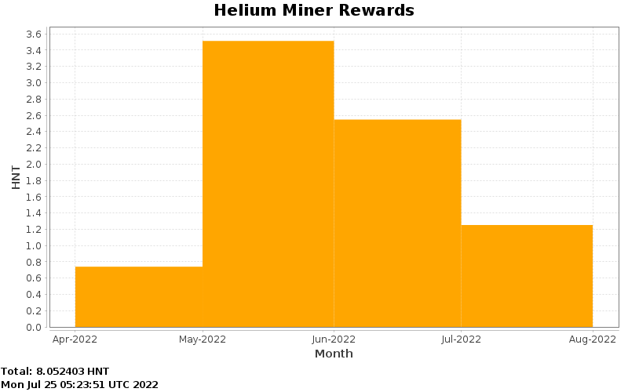

# Helium miner stats
Generate a weekly updated chart to track my miner rewards.

## Chart

### Features:
- Download daily rewards of the miner and save them into the `data` directory (via Github actions)
- Generate a weekly updated chart out of this data (via Github actions)

### Request example

    curl -o 2022-05-04.json \
     -H 'accept: application/json' \
     -H 'accept-language: de-CH,de-DE;q=0.9,de;q=0.8,en-US;q=0.7,en;q=0.6' \
     -H 'user-agent: Mozilla/5.0 (Macintosh; Intel Mac OS X 10_15_7) AppleWebKit/537.36 (KHTML, like Gecko) Chrome/101.0.4951.54 Safari/537.36' \
     'https://api.helium.io/v1/hotspots/113M3PcKpZRsdBhzjJZ9nxGK3pXDfqKGQqzb8p1CRmYQ7gyBT8U/rewards/sum?min_time=2022-05-04T00%3A01%3A00.000Z&max_time=2022-05-04T23%3A59%3A59.000Z'
